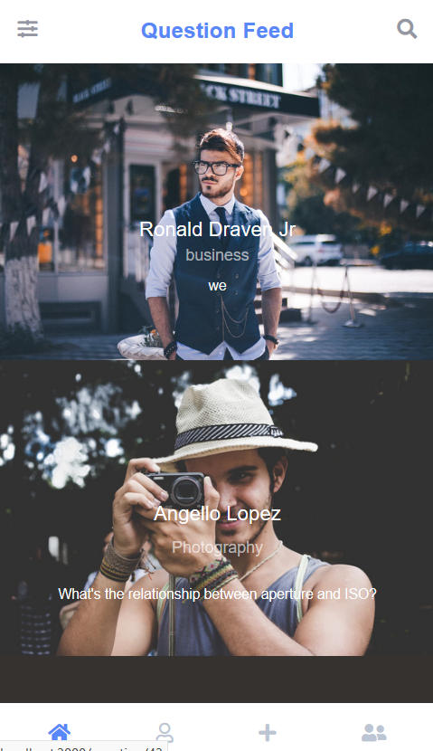
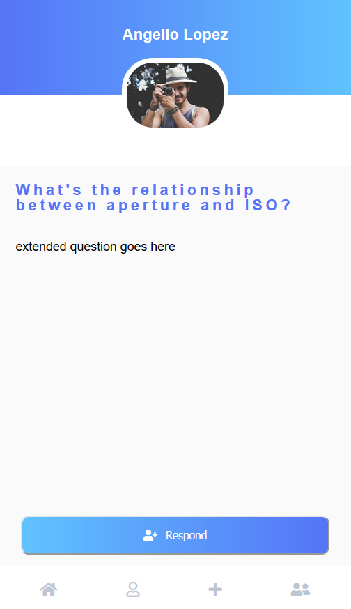
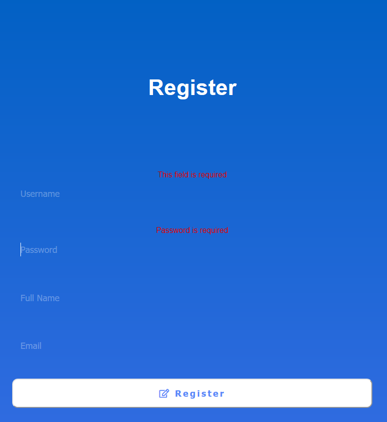
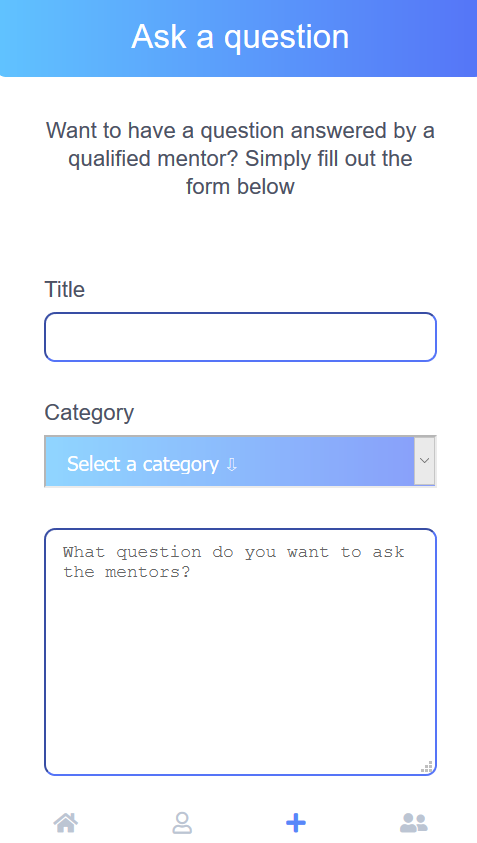

# Mentor Me

Mentor Me is an App created to bring together student and teacher into a one on one atmosphere. 

Modern education has seen the relationship between student and teacher widen for the several past decades, larger classroom sizes and less one on one time has left many students feeling jaded and lost in the transition between beginner and mastery. Our app helps erase this gap! 

The mentor experience has never been smoother. Our Question Feed allows a mentor to quickly scan questions of potential students related to the mentor's expertise. 

Then they can easily start a conversation with their new student.

Students can create a profile and post a question to the Question Feed

Both student and mentor can set up their own unique profiles.

https://team-mentor-me.github.io/mentor-me-landing/
